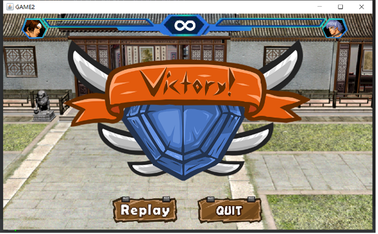

# 拳皇：Java双人网络对战游戏

 

开发者：Zimo

## 1. 介绍

本项目拳皇游戏是一款休闲类格斗游戏，支持双人联机对战，容易上手、操作简单，是闲暇之余休闲娱乐不可缺少的一款游戏。本项目基于面向对象的java语言，采用swing框架，主要应用的技术有：Exception, Thread, GUI, Network, I / O stream, Collection等。

### 1.1 Exception

异常的捕获主要用于网络连接异常的捕获，如socket的输入输出流。

### 1.2 Thread

线程技术主要用于两个主要方面。第一，网络连接的服务端使用了多线程，允许连接多个客户端并对其进行信息收发；第二，在GUI主面板中使用到多线程实时刷新面板画面。 

### 1.3 GUI

本项目依赖图形界面程度高，主要基于java的swing框架进行开发，在开始面板、提示面板、主面板等多处使用了GUI技术。

### 1.4 Network

本项目支持双人联机对战，主要使用了TCP/IP网络技术，建立客户端与服务端之间的连接，并进行多客户端的同步操作，使联机成为可能。

### 1.5 I/O Stream

本项目的I/O流技术主要使用在客户端与服务端之间信息的收发，在双人游戏中起到建立客户端与服务端、客户端与客户端之间通信的作用。

### 1.6 Collection

本项目主要用到集合的地方有：客户端建立线程集合有利于管理多个线程；将图片组放在集合中有利于调用。

## 2. 功能展示

### 2.1 开始界面

#### 2.1.1 开始游戏

点击按钮"start"进行网络连接，如果连接失败，则会提示“网络连接失败”；若连接成功，则会出现连接成功等待提示。

 

#### 2.1.2 帮助

点击问号图标，即可进入帮助界面，按下返回关闭：

 

 

#### 2.1.3 背景音乐

程序自动触发背景音乐，点击音乐按钮即可关闭背景音乐，同时图标变成静音图标；再次点击可重新打开背景音乐。

 

### 2.2 进入游戏

#### 2.2.1 操作

按住W S A D键分别为上、下、左、右移动，J键为攻击键。

 

靠近角色，按下攻击键，则会触发攻击。若被击中，血条格数减1，并且被攻击角色被击倒。

 

#### 2.2.2 游戏结束

 

当某一方角色血量为0时，游戏结束，弹出胜利/失败窗口，点击replay可重玩游戏，等待其他玩家进入；点击quit即可回到开始界面。